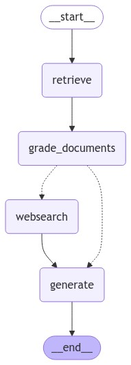
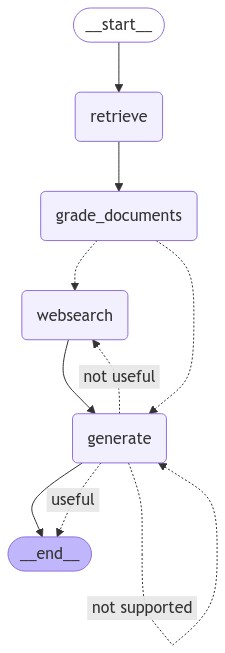
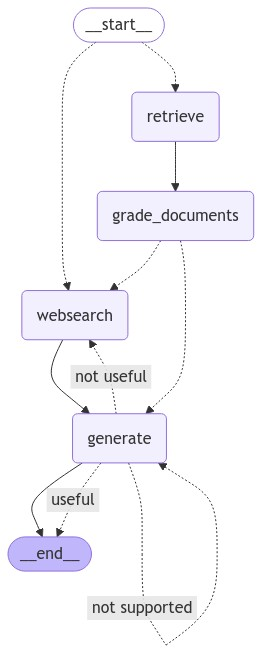

# C-RAG

## Introduction

The codebase of C-RAG

### General information

- This project uses conda as an environment manager. The user must have Anaconda or Miniconda installed.
- This project uses git-hooks to check code quality when creating commits.

### Repository!

- https://github.com/bchabros/C_RAG.git

### Local env setup

#### 1. Conda

- Install conda (miniconda version): https://docs.conda.io/projects/conda/en/latest/user-guide/install/index.html
- Install conda (anaconda navigator version): https://anaconda.org/anaconda/conda
- Make sure conda directory (`C:\Users\<USER>\AppData\Local\miniconda3`) or (`C:\Users\<USER>\AppData\Local\conda`) is added to PATH environment variable in Windows
- Create conda environment from `env.yaml`: `conda env create -f env.yaml`
- Activate environment: `conda activate leap-llm-backend`

#### 2. .env file

- Create `.env` file in the project's root directory (based on .env-sample file). The content of `.env` is not stored in Git repository, because it contains secrets.

#### 3. PyCharm settings

- Edit Run/Debug configurations in PyCharm and make sure to select the correct `.env` file and conda environment
- In PyCharm choose `File -> Settings -> Python interpreter` and select `CRAG` environment

#### 4. Main Files

- **main** - main script contains the rag which grade documents if they relevant them use them, or it is not then use websearch (tavily to find additional information).         

- **main_self_rag** - main script similar to previous one but self check if info from websearch was useful and model does hallucinate if yes then repeat until he won't get accept that it use relevant info and did not hallucinate.   

- **main_adaptive_rag** - main script devlop on first check so If question is about something about LLM then check document otherwise it will pass this process and use only websearch.   
